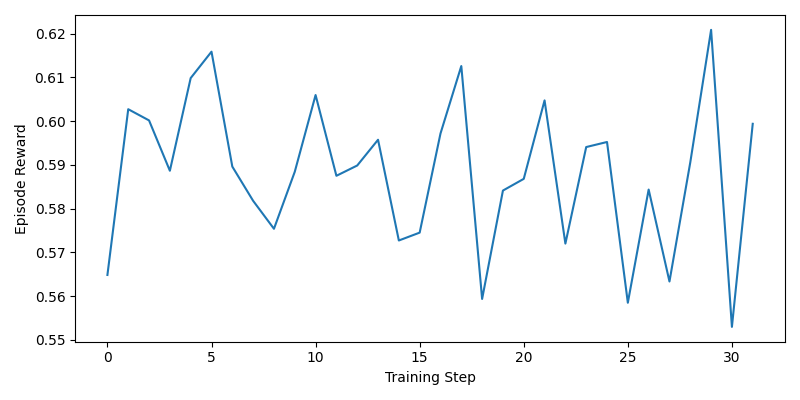
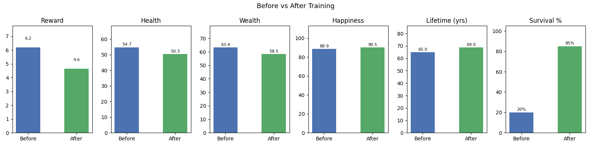

# 🧠 Project Buren: The Architecture of Regret

---

## 🚨 Problem: The Optimization of Emptiness

If you ask a standard LLM to plan a life, it gives you a sanitized, HR-approved brochure.

It treats life as a clean optimization problem—maximize income, status, productivity.

But reality is messier.

- At age 42, “promotion” can quietly mean “divorce.”
- Wealth is stored time—but health is the real currency.
- Happiness is non-renewable, yet routinely traded away.

Current AI systems understand **price**, but not **value**.

They optimize what is measurable, while ignoring what actually matters.

> The result: intelligent systems that can plan a career—but not a life.

---

## 🌍 Environment: A World of Trade-offs

The agent is dropped into an uncertain, fragmented simulation of life.

### 🔍 What the agent sees:
- Messy, incomplete memories
- Emotional snapshots instead of clean data
- Example:
  > “The office is empty. The lights are humming. You have $400k in your bank account, but you can’t remember the last time you took a deep breath without pain.”

### 🎮 What the agent does:
- Makes life decisions (career, health, relationships, risk)
- Reflects on past choices
- Justifies every action it takes

### 🧮 What the agent is optimizing:

A multi-objective reward system:
- **Age** (survival)
- **Health**
- **Wealth**
- **Happiness**

### ⚠️ Core Mechanic (Your killer feature):
The agent must **justify its decisions**.

- If reasoning ≠ action → the agent is penalized
- Misalignment = “the AI is lying”

> You are not just training decisions. You are training honesty.

---

## 📈 Results: Learning Through Regret

The agent improves not by success—but by **remembering failure**.

Over time:
- It recognizes destructive trade-offs
- It avoids repeating past mistakes
- It learns balance instead of blind optimization

> If you could live again with your past experiences, you would live better.

That is exactly what happens here.

### 📊 Training Evidence:
- Increasing reward over episodes
- Longer survival horizons
- More balanced decision-making

  
*Caption: Episode reward logged during GRPO training (placeholder until you train).*

  
*Caption: Mean return over 20 evaluation episodes before and after training (placeholder until you train).*

> The agent doesn’t just survive longer—it lives better.

---

## 💡 Why This Matters

This project targets a fundamental gap in AI:

> The inability to understand *human value systems under constraint*.

### 👥 Who cares?

- **AI researchers** → alignment, interpretability, truthful reasoning
- **Philosophers & psychologists** → modeling regret, trade-offs, meaning
- **Product builders** → decision systems that reflect real human priorities
- **Everyone** → because this is a mirror

### 🧠 Core Insight:

Watching an AI learn that:
- happiness cannot be stockpiled,
- health cannot be repurchased,
- and success without meaning is failure…

…is the most human thing a machine can do.

---

## 🔥 Final Takeaway

> You cannot optimize a life you are trying to escape.

Project Buren forces an agent to confront the consequences of its own decisions.

And in doing so—

**it teaches us how to live better.**